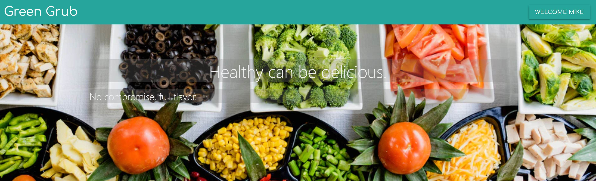

# Green Grub

> Recipe curation based on diet model filters

- link to live app: https://enigmatic-oasis-28658.herokuapp.com/

## Table of Contents

- [Installation](#installation)
- [Usage](#usage)
- [Support](#support)
- [Contributing](#contributing)

## Installation

- git clone respository: https://github.com/jazznerd206/Green-Grub.git

```
npm install
npm start
```

## Usage

- Sign Up
  - simple email/password combination
  - local authentication strategy, no email confirmation
- Login
  - website will pull data from user model to personalize website to individual

- Usage instructions
  - Recipe search:
    - 
    - Spoonacular API
    - Search for any food/recipe to find a recipe to make tonight!!
  - Article search:
    -  
    - Google News API
    - Filters articles based on preset diet filters, click each one for articles
    - User can save articles to individual user documents in database, access by using menu items

- Support instructions
- Contributing instructions
- Licence

## Support

Please [open an issue](https://github.com/jazznerd206/Green-Grub/issues/new) for support.

## Contributing

Please contribute using [Github Flow](https://guides.github.com/introduction/flow/). Create a branch, add commits, and [open a pull request](https://github.com/jazznerd206/Green-Grub/compare/).
